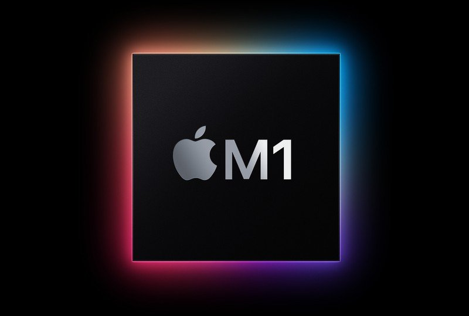
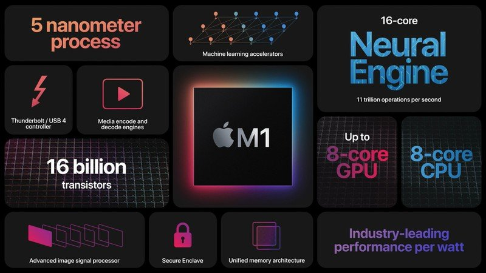
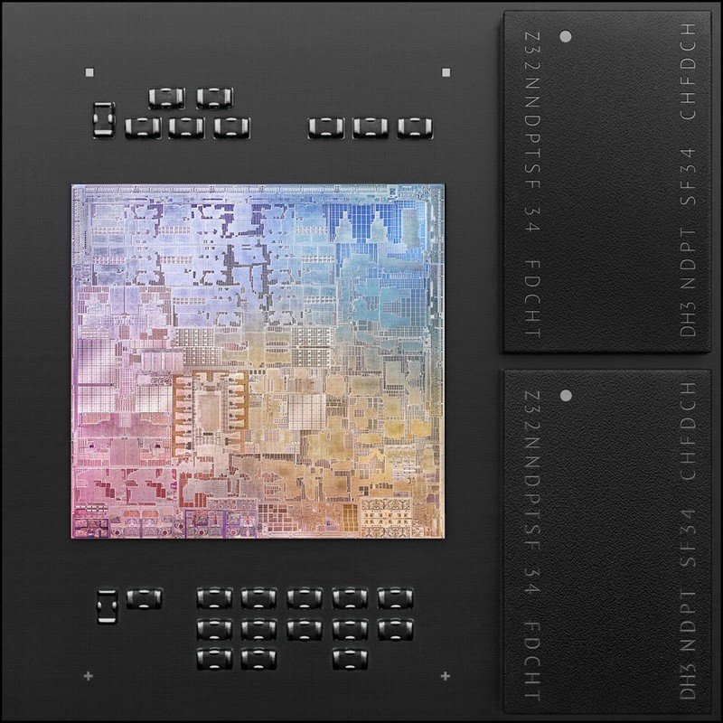
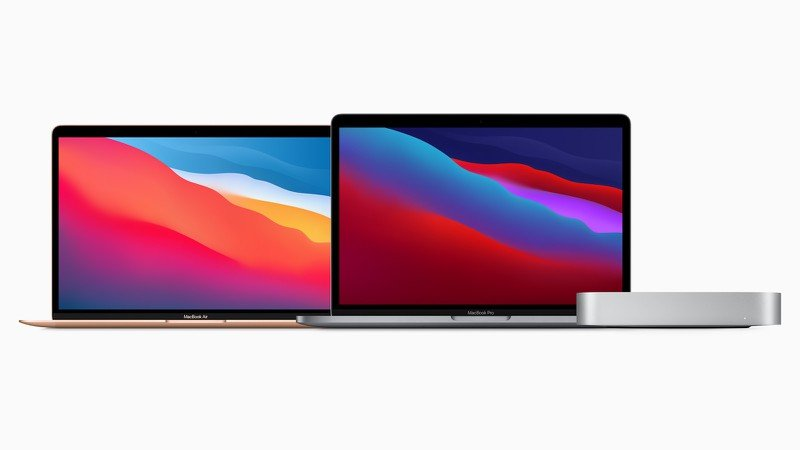
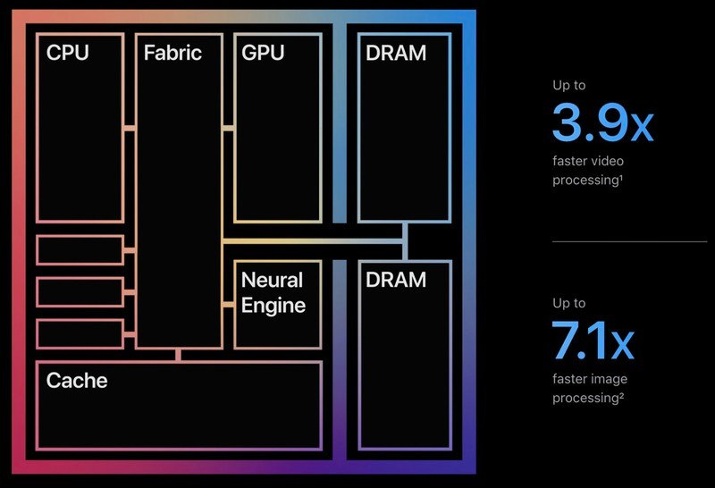
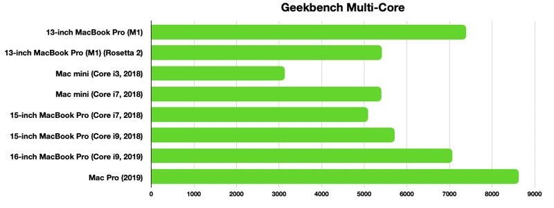
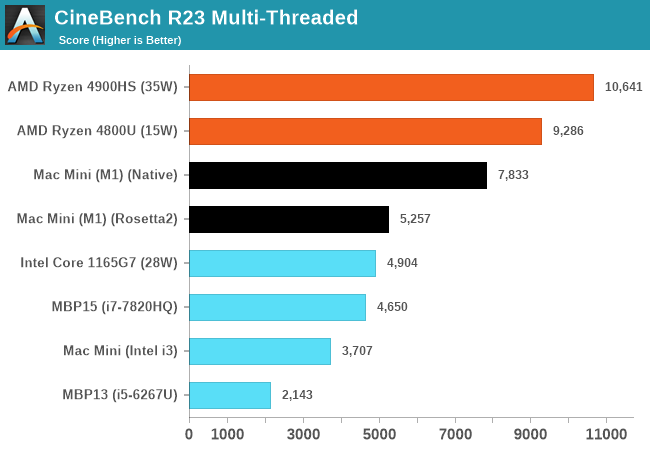

# Apple M1

**Apple M1** – procesor firmy Apple. Stanowi pierwszy układ SoC oparty na architekturze ARM, zaprojektowany przez firmę Apple Inc. jako procesor centralny dla komputerów Macintosh.



Inspiracją był układ ARM A14. W obecnej chwili jest on stosowany w komputerach MacBook Air (M1, 2020), Mac mini (M1, 2020) i MacBook Pro (13-calowy, M1, 2020). Ponadto stanowi pierwszy układ scalony do komputerów osobistych zbudowany w procesie technologicznym 5 nm. 

Według zapowiedzi Apple oraz w opinii wielu osób, oznacza on odejście firmy Apple od układów Intela, których firma z Cupertino używała w komputerach Mac od 2006 roku.

## Spis treści
1. Opis układu M1
1. Wyjątkowość M1
1. M1 w szczegółach
1. Żywotność baterii
1. Uruchamianie aplikacji na Mac wyposażonych w M1
1. Nanografia

## 1. Opis układu M1

### Architektura M1

Jako SoC (_**S**ystem **o**n a **C**hip_), M1 integruje kilka różnych komponentów, takich jak CPU, GPU, ujednoliconą architekturę pamięci (RAM), Neural Engine, warstwę zabezpieczeń (Secure Enclave) czy kontroler SSD. Ponadto zarządza procesorem sygnału obrazu, silnikiem kodowania/dekodowania, kontrolerem Thunderbolt z obsługą USB 4 oraz innymi peryferiami.

### Zunifikowana architektura pamięci
Do tej pory komputery Mac oparte o architekturę Intela korzystały z wielu pobocznych układów obsługujących CPU, I/O i zabezpieczenia. Apple postanowiło zintegrować te układy, przez co M1 jest o wiele szybszy i wydajniejszy niż wcześniejsze układy Intela. Zunifikowana architektura pamięci wbudowana w układ M1 sprawia, że CPU, GPU i inne komponenty procesora mają natychmiastowy dostęp do tej samej puli danych (nie muszą kopiować danych między sobą). 



Z drugiej strony taka architektura pamięci oznacza, że nie ma możliwości rozbudowy pamięci RAM przez użytkownika. Maksymalnie Mac M1 może mieć 16 GB RAM, ale nawet podstawowe 8 GB powinno wystarczyć do płynnego wykonywania codziennych zadań.

## 2. Wyjątkowość M1
### Przełomowy proces litograficzny


Układ M1 jest najpotężniejszym układem, jaki Apple stworzyło do tej pory.  Porównywalnie do układu A14 w najnowszych modelach iPhone'a i iPada Air, jest zbudowany w 5-nanometrowym procesie technologicznym przez Taiwan Semiconductor Manufacturing Company (TSMC), który buduje wszystkie chipy Apple od wielu lat.

W M1 znajduje się 16 miliardów tranzystorów, czyli najwięcej kiedykolwiek Apple umieściło w jednym układzie scalonym. Przekłada się to na najszybszy rdzeń procesora dostępny w krzemie o niskim poborze mocy i niezrównaną dotąd wydajność procesora w przeliczeniu na Wat. Układy scalone Apple pozwoliły na stworzenie komputerów Mac, które są nie tylko szybsze i bardziej energooszczędne, ale także otwierają drogę na dalsze ulepszenia dzięki nowej, ściślejszej integracji układu scalonego.

### Komputery Mac z chipem M1


Apple do tej pory wypuściło MacBooka Air 2020, 13-calowego MacBooka Pro i Maca mini z układami M1, zastępując nimi podstawową linię urządzeń. W tym momencie MacBook Air z układem M1 jest jedynym MacBookiem Air produkowanym przez Apple, ale nadal oferowane są modele Mac mini i MacBook Pro z procesorami Intela.

W 2021 planowana jest premiera MacBooka Pro 16 oraz nowego iMaca, które będą korzystały z _Apple Silicon_. W tym momencie przestaje być opłacalny zakup Mac Mini czy 13-calowego MacBooka Air z procesorem Intela, ponieważ układ M1 przewyższa wydajnością i energooszczędnością wszystkie dotychczasowe układy, a ustępuje jedynie procesorom desktopowym.

## 3. M1 w szczegółach
### Specyfika układu
Układ M1 zawiera 8-rdzeniowy procesor z czterema wysokowydajnymi rdzeniami i czterema rdzeniami zoptymalizowanymi pod kątem zużycia energii. 

Wysokowydajne rdzenie zostały zaprojektowane tak, aby zapewnić najlepszą wydajność w wymagających dużej mocy obliczeniowej zadaniach jednowątkowych. Mogą współpracować ze sobą oferując imponującą wydajność wielowątkową, dzięki której komputery Mac M1 prześcigają nawet najbardziej zaawansowane 16-calowe modele MacBooków Pro.

Do zadań mniej intensywnych i niewymagających tak dużej mocy obliczeniowej, takich jak przeglądanie stron WWW, przeznaczone są cztery energooszczędne rdzenie, które zużywają jedną dziesiątą mocy obliczeniowej w celu wydłużenia czasu pracy na baterii.
Apple twierdzi, że rdzenie te oferują wydajność zbliżoną do dwurdzeniowego MacBooka Air poprzedniej generacji, ale przy znacznie niższym poborze mocy. 

Rdzenie te mogą pracować samodzielnie, gdy nie jest potrzebna znaczna moc, ale w przypadku wymagających zadań można jednocześnie zaangażować wszystkie osiem rdzeni.



### CPU - szybkość Apple M1
Układ M1 oferuje do 3,5x szybszą wydajność CPU, do 6x szybszą wydajność GPU i do 15x szybsze możliwości uczenia maszynowego w porównaniu z układami Intela stosowanymi w maszynach poprzedniej generacji.

W porównaniu z najnowszymi układami stosowanymi w laptopach PC, M1 oferuje nawet dwukrotnie szybszą pracę procesora i to przy wykorzystaniu zaledwie 25 procent mocy.

Benchmarki MacBooka Air, MacBooka Pro i Maca mini potwierdziły imponującą wydajność układu M1. Pomiędzy poszczególnymi modelami występują pewne różnice, ale wszystkie mają najwyższą wydajność jednordzeniową spośród wszystkich komputerów Mac, a wydajność wielordzeniową na równi z komputerami stacjonarnymi Apple.

Mac mini, który uzyskał najwyższy wynik w grupie komputerów Mac, uzyskał w teście Geekbench 5 dla pojedynczego rdzenia 1702 pkt, a w teście wielordzeniowym 7380 pkt. Niewiele gorzej uplasował się MacBook Pro zdobywając w tym samym teście 7351 pkt.

|| 
|:-------------:|
|*Benchmark M1 - Geekbench Multi-Core - Apple*|

|| 
|:-------------:|
|*CineBench R23 Multi-Threaded - Apple vs Intel/AMD*|

|[](http://www.youtube.com/watch?v=xNNTXd85VXo)| 
|:-------------:|
|**Sprawdź jak Apple M1 miażdży Macbooka Pro na Intelu**|

### GPU
Układ GPU Apple Silicon jest wyposażony także w 8-rdzeniowy procesor graficzny, ale w podstawowej wersji MacBooka Air (8GB) jeden z rdzeni jest wyłączony, dzięki czemu dostępne jest tylko 7 rdzeni układu.

Procesory graficzne w modelach Mac mini, MacBook Pro i wyższej klasy M1 MacBook Air są 8-rdzeniowe i mogą wykonywać jednocześnie blisko 25 000 wątków z wydajnością 2,6 teraflopów. Według firmy Apple, M1 ma najszybszy zintegrowany układ graficzny w komputerze osobistym.

Testy wydajności graficznej sugerują, że układ M1 oferuje wydajność przewyższającą karty GeForce GTX 1050 Ti i Radeon RX 560. Uzyskał on także wynik 19305 punktów w OpenCL, podobny do wyników Radeona RX 560X i Radeona Pro WX 4100.


### Silnik neuronowy
Układ M1 posiada wbudowany silnik Neural Engine - komponent, który Apple zaczęło dodawać do swoich układów z serii A kilka lat temu. Neural Engine ma za zadanie przyspieszać zadania związane z uczeniem maszynowym w komputerach Mac, takie jak analiza wideo, rozpoznawanie głosu, przetwarzanie obrazu i inne.

16-rdzeniowy Neural Engine jest w stanie wykonać 11 bilionów operacji na sekundę, co przekłada się na nawet 15-krotnie większą wydajność uczenia maszynowego w porównaniu z poprzednią generacją modeli.


## 4. Żywotność baterii
Pomimo niewiarygodnego wzrostu szybkości, jaki oferuje układ M1, jest on także bardziej oszczędny pod względem zużycia baterii niż jakikolwiek inny układ nie tylko wydany do tej pory przez Apple, ale w ogóle.

Bateria w komputerze Mac z układem M1 działa nawet dwukrotnie dłużej niż w komputerach Mac poprzedniej generacji. Najdłużej pracującym na baterii komputerem Mac jest 13-calowy MacBook Pro, który może pracować nawet przez 20 godzin. To dwukrotnie dłuższy czas pracy na baterii niż w przypadku modelu poprzedniej generacji.

## 5. Uruchamianie aplikacji na komputerach Mac z M1
Ponieważ układ M1 wykorzystuje inną architekturę, firma Apple przygotowała narzędzia umożliwiające programistom tworzenie uniwersalnych binariów aplikacji, które działają bezbłędnie zarówno na układach Apple Silicon, jak i Intel. Większość popularnych aplikacji na Maca jest aktualnie przepisywana z myślą o natywnym działaniu na komputerach Mac z procesorem M1. Niemniej jednak Apple opracowała warstwę translacji Rosetta 2, która umożliwia uruchamianie aplikacji x86 na układzie M1.

### Rosetta 2
Rosetta 2 to nowe oblicze _Rosetty_ - funkcji, która umożliwiała uruchamianie aplikacji PowerPC na komputerach Mac z procesorami Intel w 2006 roku, gdy firma Apple przeszła z PowerPC na Intel.

Dzięki Rosetta 2 aplikacje przeznaczone dla urządzeń Apple z procesorami Intela nadal będą działać na komputerach Mac z procesorami M1, przy czym wydajność będzie ograniczona. Należy nadmienić, że translacja kodu ma miejsce tylko raz, a w większości przypadków aplikacje będą działały podobnie na komputerach Mac z procesorami Intel i M1 ze względu na usprawnienia wydajności wprowadzone w M1.

Aby sprawdzić czy dana aplikacja działa dzięki tłumaczeniu Rosetta 2 lub natywnie, możesz wywołać funkcję sysctlbyname z flagą sysctl.proc_translated, jak pokazano w poniższym przykładzie. Funkcja zwraca wartość `0` dla procesu rodzimego, `1` dla procesu przetłumaczonego i `-1`, gdy wystąpi błąd.

```shell script
int processIsTranslated() {
   int ret = 0;
   size_t size = sizeof(ret);
   if (sysctlbyname("sysctl.proc_translated", &ret, &size, NULL, 0) == -1) 
   {
      if (errno == ENOENT)
         return 0;
      return -1;
   }
   return ret;
}
```

Kompletny spis aplikacji dla macOS zoptymalizowanych dla procesora M1 znajdziesz [tutaj](https://isapplesiliconready.com/pl).

### Aplikacje spoza MacOS
W chwili obecnej istnieje jedna poważna niedogodność dla osób, które potrzebują dodatkowej obsługi systemu Windows - nie ma możliwości uruchomienia Boot Camp dla Mac M1. Oficjalne wsparcie może pojawić się w przyszłości, ale zależy to w dużej mierze od Microsoftu.

Co ciekawe, na komputerach Mac z procesorem M1 można uruchamiać aplikacje dla iPhone'a i iPada, o ile twórcy aplikacji udostępnią je na komputerach Mac.


### Przyszłość Apple Silicon
Apple planuje przejście całej linii komputerów Mac na układy Apple Silicon, całkowicie rezygnując z układów Intela. Apple spodziewa się, że proces przenoszenia całej linii produktów do Apple Silicon potrwa około dwóch lat.

Następne komputery Mac, które mogą otrzymać układy Apple Silicon to 24-calowa wersja iMac, oraz przeprojektowane 16-calowe i 14-calowe modele MacBook Pro.

## 6. Nanografia
- https://www.anandtech.com/show/16252/mac-mini-apple-m1-tested/2
- https://www.apple.com/mac/m1/
- https://developer.apple.com/documentation/apple-silicon/about-the-rosetta-translation-environment
- https://appleinsider.com/articles/20/11/17/m1-benchmarks-proves-apple-silicon-outclasses-nearly-all-current-intel-mac-chips
- https://isapplesiliconready.com/pl
- https://www.macrumors.com/guide/m1/
- https://www.youtube.com/watch?v=xNNTXd85VXo
- https://en.wikipedia.org/wiki/Apple_M1
